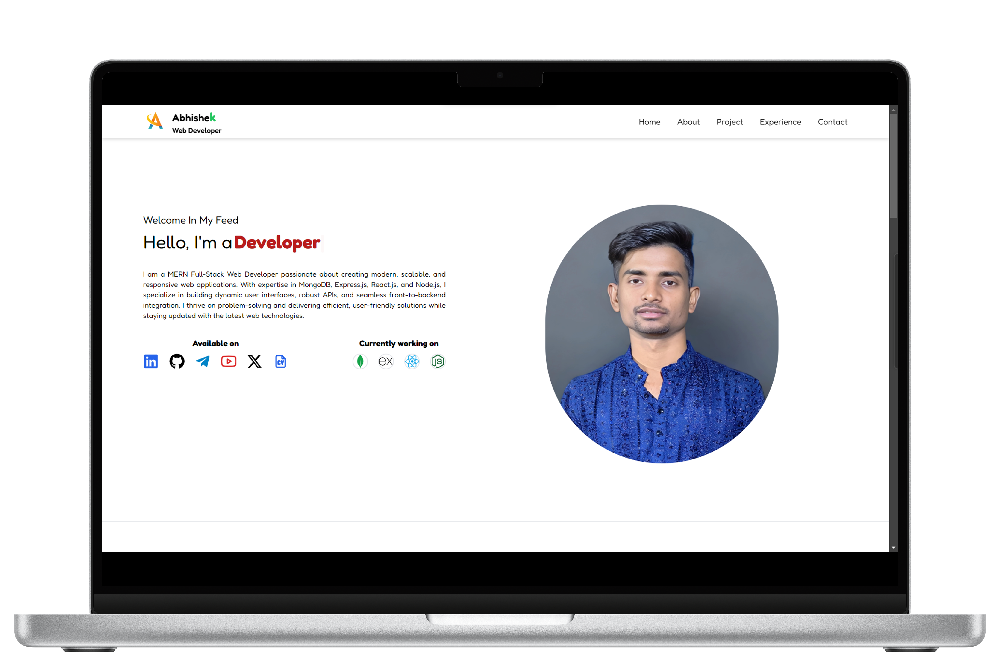

# Portfolio 💫

## Desktop 💻

 npm i react-hot-toast

## 📝 Description

This is a simple portfolio website built using HTML, CSS, JavaScript, Tailwind CSS and Vite(daisyUI) . It includes a responsive design that works well on both desktop and mobile devices. The website is designed to showcase your skills, experience, and achievements.

## 💻 Technologies

- HTML
- CSS
- JavaScript
- Tailwind CSS
- Vite
- daisyUI
- React
- Node.js
-
- MIT License
- [Abhishek Patel](https://github.com/PatellAbhishekk/)

## 📦 Installation

To install this project, follow these steps:

##  Vite

```bash
npm create vite@latest ./portfolio

npm install

pnpm install

pnpm run dev
```

## Tailwind CSS

```bash
## Install Tailwind CSS
npm install -D tailwindcss postcss autoprefixer

npx tailwindcss init -p

## Add the following to your tailwind.config.js file
 content: [
    "./index.html",
    "./src/**/*.{js,ts,jsx,tsx}",
  ],

## paste in index.css file
@tailwind base;
@tailwind components;
@tailwind utilities;

## run devlopment server
npm run dev
```

#  daisyUI

```bash
npm i -D daisyui@latest

module.exports = {
  //...
  plugins: [
    require('daisyui'),
  ],
}
```

##  About

This is a simple portfolio website built using HTML, CSS, and JavaScript. It includes a responsive design that works well on both desktop and mobile devices.

##  Features

- Responsive design that works well on both desktop and mobile devices
- Navigation menu with dropdowns
- Gallery section with images and captions
- About section with bio and contact information
- Contact form with validation
- Dark mode toggle

##  Getting Started

To get started, follow these steps:

1. Clone the repository to your local machine.
2. Open the project in your preferred code editor.
3. Customize the CSS and JavaScript files as needed.
4. Test the website on different devices and browsers.

##  Customization

You can customize the website by modifying the CSS and JavaScript files. Here are some suggestions:

- Change the font family and size of the text.
- Modify the colors of the website to match your preferences.
- Add or remove images and captions from the gallery section.
- Update the contact form with your own fields and validation rules.

##  Contributing

Contributions are welcome! If you find any bugs or have suggestions for improvements, please open an issue or submit a pull request on the GitHub repository.

##  License

This project is licensed under the MIT License.

[](https://raw.githubusercontent.com/PatellAbhishekk/Portfolio/refs/heads/main/LICENSE)
